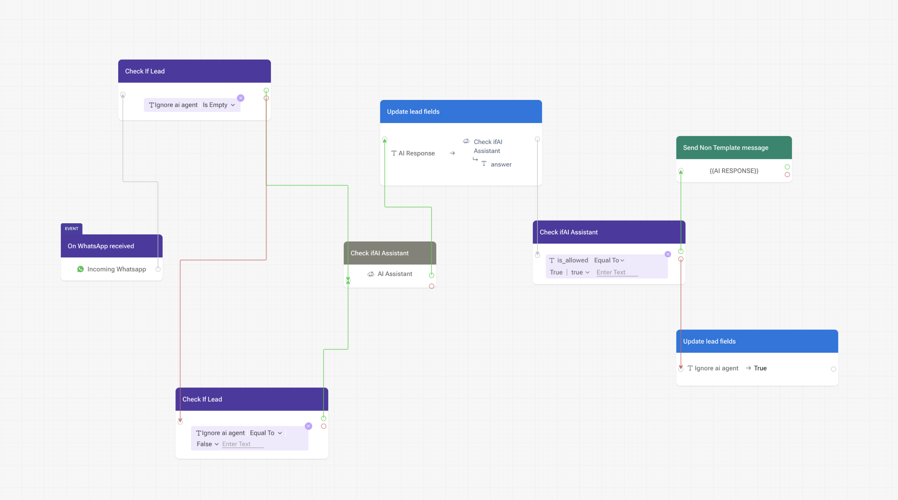

# TeleCRMFlow
It is designed for tour enquiries, especially Azerbaijan travel packages, and helps:

- greet and qualify leads
- collect missing trip details
- answer package and travel questions from a local knowledge base
- maintain short conversation memory per phone number
- hand off to a human agent when needed

The project exposes two ways to interact with the assistant:

- a FastAPI endpoint for backend integrations
- a Chainlit chat UI for local testing and demos

## What the app does

A user sends a message with a phone number. The app then:

1. loads recent conversation history for that phone number
2. identifies the message language
3. summarizes prior context
4. classifies the intent using Semantic Kernel prompt functions
5. collects missing lead data when required
6. retrieves relevant knowledge from a FAISS index
7. generates a grounded answer
8. decides whether a human agent should take over
9. stores the updated conversation state in cache

## Core capabilities

- **Lead qualification**: asks for missing travel details such as travel date, origin, and number of people
- **Retrieval-augmented answers**: searches a local FAISS index for package and travel information
- **Short-term memory**: keeps recent messages per conversation
- **Agent handoff**: marks conversations that should be handled by a human
- **Multi-interface support**: works through API and Chainlit UI
- **Prompt-driven orchestration**: uses Semantic Kernel plugins and prompt files instead of a large hardcoded decision tree

## Architecture overview

### Entry points

- [main.py](main.py) — FastAPI app with a `POST /chat` endpoint
- [ui.py](ui.py) — Chainlit UI for interactive chat testing

### Orchestration

- [orc/orchestrator.py](orc/orchestrator.py) — loads conversation state, calls the orchestration layer, stores responses
- [orc/run.py](orc/run.py) — Semantic Kernel workflow for language detection, triage, data collection, retrieval, and final answer generation

### Connectors

- [connectors/aoai.py](connectors/aoai.py) — OpenAI chat and embedding helper
- [connectors/aisearch.py](connectors/aisearch.py) — FAISS vector store load/search logic
- [connectors/cosmos.py](connectors/cosmos.py) — in-memory TTL conversation cache used as the session store

### Knowledge and prompts

- [knowledgebase/index.faiss](knowledgebase/index.faiss) — vector index used for retrieval
- [orc/bot_description.prompt](orc/bot_description.prompt) — assistant persona and role
- [orc/plugins/Conversations](orc/plugins/Conversations) — prompt functions for triage, language detection, data collection, summary, and answering
- [orc/plugins/Retrieval/retrieval.py](orc/plugins/Retrieval/retrieval.py) — retrieval plugin that queries the FAISS store

## Request flow

```text
Client/API/UI
   -> FastAPI or Chainlit
   -> Orchestrator
   -> Conversation cache
   -> Semantic Kernel plugins
   -> FAISS retrieval
   -> OpenAI model
   -> Final answer + optional agent escalation
```

## CRM automation flow

The repository also includes a CRM automation flow screenshot at [flow.png](flow.png).



This diagram represents the higher-level business workflow around TeleCRMFlow inside the CRM layer. It is useful for understanding how the assistant fits into the broader lead handling process beyond the Python app itself.
 
## Tech stack

- Python
- FastAPI
- Chainlit
- OpenAI API
- Microsoft Semantic Kernel
- LangChain Community FAISS integration
- FAISS CPU
- Pydantic
- Tenacity
- Cachetools

## Conversation memory behavior

The current implementation uses an in-memory TTL cache, not a real database.

Important behavior:

- conversation state is stored by phone number
- only the **last 5 messages** are kept per conversation
- cache entries expire after **3 days**
- restarting the app clears the cache
- user profile data is stored separately using a `:user_data` suffix

This behavior is implemented in [connectors/cosmos.py](connectors/cosmos.py).

## Intent handling

The orchestration logic supports several intent paths, including:

- `greeting`
- `follow_up`
- `question_answering`
- `about_bot`
- `off_topic`
- `none`

For travel questions and follow-ups, the app may first collect missing fields before answering. If the answer stage flags escalation, the user gets a waiting message and the conversation is marked for agent takeover.

## Requirements

- Python 3.10+ for local Docker parity
- Python 3.11 recommended for Render parity
- an OpenAI API key

## Environment variables

Create a `.env` file or export the variable in your shell:

- `OPENAI_API_KEY` — required for chat completion and embeddings

Example:

```env
OPENAI_API_KEY=your_openai_api_key_here
```

## Local setup

### 1. Clone and enter the project

```bash
git clone <your-repo-url>
cd TeleCRMFlow
```

### 2. Create and activate a virtual environment

```bash
python3 -m venv .ven
source .ven/bin/activate
```

### 3. Install dependencies

```bash
pip install -r requirements.txt
```

### 4. Set environment variables

```bash
export OPENAI_API_KEY="your_openai_api_key_here"
```

## Run locally

### Option 1: Run the FastAPI API

```bash
uvicorn main:app --host 0.0.0.0 --port 8000 --reload
```

The API will be available at:

- `http://localhost:8000/chat`

### Option 2: Run the Chainlit UI

```bash
chainlit run ui.py
```

Chainlit will open a browser-based chat UI where the user is first asked for a phone number.

## API usage

### Endpoint

`POST /chat`

### Admin endpoints

- `GET /admin` — browser-based admin UI for prompt and knowledge base management
- `GET /admin/api/prompts` — list editable prompt files
- `GET /admin/api/prompts/{prompt_id}` — load one prompt file
- `PUT /admin/api/prompts/{prompt_id}` — save prompt changes without redeploying
- `GET /admin/api/knowledge-base/documents` — list managed knowledge documents and indexing status
- `POST /admin/api/knowledge-base/documents` — upload a UTF-8 text document
- `GET /admin/api/knowledge-base/documents/{document_name}` — load one managed document
- `PUT /admin/api/knowledge-base/documents/{document_name}` — update one managed document
- `DELETE /admin/api/knowledge-base/documents/{document_name}` — remove one managed document
- `POST /admin/api/knowledge-base/refresh` — rebuild the FAISS index from managed documents

### Request body

```json
{
  "phone": "+971500000000",
  "ask": "What Azerbaijan packages do you have?",
  "history": []
}
```

### Response body

```json
{
  "id": "+971500000000",
  "answer": "We have multiple Azerbaijan package options...",
  "is_allowed": true
}
```

### Field notes

- `id` returns the phone number
- `answer` is the assistant reply
- `is_allowed` becomes `false` when the system wants human-agent follow-up
- `history` exists in the schema but is not currently used by the endpoint logic

### Example `curl`

```bash
curl -X POST http://localhost:8000/chat \
  -H "Content-Type: application/json" \
  -d '{
    "phone": "+971500000000",
    "ask": "I want to travel from Dubai next month with 2 adults"
  }'
```

## Prompt and plugin system

The assistant behavior is controlled mainly through prompt files under [orc/plugins](orc/plugins).

Key prompt functions include:

- `Language` — detects the user language
- `ConversationSummary` — compresses recent history for context
- `Triage` — determines the user intent and next action
- `CollectData` — extracts or requests required travel details
- `Answer` — creates the final grounded response

This makes it easy to refine assistant behavior without rewriting the Python orchestration layer.

## Knowledge base

The retrieval layer uses a local FAISS index stored in [knowledgebase/index.faiss](knowledgebase/index.faiss).

Operationally managed source documents should now be stored under [knowledgebase/documents](knowledgebase/documents). The admin UI writes files there and rebuilds the FAISS index on demand.

The current knowledge base appears focused on:

- Azerbaijan package itineraries
- hotel options
- visa guidance
- flight duration
- SIM card advice
- card vs cash guidance
- child pricing rules

## Admin management UI

The app now includes an operations-facing admin page at `GET /admin`.

It supports:

- viewing and editing all live prompt files used by the orchestrator
- uploading new UTF-8 text documents for retrieval
- editing and deleting existing managed knowledge documents
- viewing per-document index status (`indexed` or `stale`)
- manually refreshing the FAISS knowledge base after content changes

Important note:

- prompt edits apply to new chat requests immediately because the orchestrator reads prompt files from disk each time it runs
- knowledge base document changes are only searchable after calling the refresh action, which rebuilds the FAISS index

Retrieval is implemented in [orc/plugins/Retrieval/retrieval.py](orc/plugins/Retrieval/retrieval.py) and [connectors/aisearch.py](connectors/aisearch.py).

## Docker

A Dockerfile is included.

Build the image:

```bash
docker build -t telecrmflow .
```

Run the container:

```bash
docker run -p 8000:8000 -e OPENAI_API_KEY="your_openai_api_key_here" telecrmflow
```

Current container entrypoint:

- [Dockerfile](Dockerfile) starts the FastAPI app with `uvicorn`

## Render deployment

A Render blueprint file is included at [render.yaml](render.yaml).

Current Render settings:

- environment: Python
- install command: `pip install -r requirements.txt`
- start command: `chainlit run ui.py`
- Python version: 3.11

## Important deployment note

There is currently a runtime mismatch between local container and Render setup:

- [Dockerfile](Dockerfile) starts **FastAPI**
- [render.yaml](render.yaml) starts **Chainlit**

That is valid if intentional, but if you want the same behavior across environments, make both entrypoints consistent.

## Customization guide

### Change the assistant persona

Edit [orc/bot_description.prompt](orc/bot_description.prompt).

### Update conversation behavior

Edit the prompt files under [orc/plugins/Conversations](orc/plugins/Conversations).

### Swap or expand the knowledge base

Update the source texts used to build the FAISS store and regenerate the index used in [knowledgebase](knowledgebase).

### Change cache rules

Edit [connectors/cosmos.py](connectors/cosmos.py) to adjust:

- TTL duration
- max cache size
- message retention count

## Known limitations

- cache is in-memory only, so state is lost on restart
- no real CRM or database integration yet
- no authentication on the FastAPI endpoint
- request `history` is defined but not used
- retrieval depends on a prebuilt FAISS index being present
- only `OPENAI_API_KEY` configuration is wired in today
- `/chat` is excluded from the generated FastAPI schema

## Suggested next improvements

- replace in-memory cache with Redis, Cosmos DB, or PostgreSQL
- add structured lead storage and CRM sync
- add health check and observability endpoints
- add tests for orchestration and prompt output parsing
- move model names and cache settings into environment variables
- add a script for rebuilding the FAISS index
- secure the API with auth or signature validation

## Troubleshooting

### `OPENAI_API_KEY` missing

If the app fails when calling the model or embeddings, verify the environment variable is set in the same shell or deployment environment.

### FAISS index not found

If retrieval fails, confirm [knowledgebase/index.faiss](knowledgebase/index.faiss) exists and is readable.

### Responses reset after restart

This is expected with the current in-memory cache implementation.

### Chainlit starts but API endpoint is unavailable

Chainlit and FastAPI are separate entrypoints in this repository. Start the interface you need.

## Project structure

```text
TeleCRMFlow/
├── main.py
├── ui.py
├── Dockerfile
├── render.yaml
├── requirements.txt
├── chainlit.md
├── connectors/
│   ├── aoai.py
│   ├── aisearch.py
│   └── cosmos.py
├── knowledgebase/
│   └── index.faiss
└── orc/
    ├── bot_description.prompt
    ├── orchestrator.py
    ├── run.py
    └── plugins/
        ├── Conversations/
        └── Retrieval/
```

## Summary

TeleCRMFlow is a lightweight AI travel-sales conversation engine that combines prompt orchestration, retrieval, and short-lived session memory. It is a good base for building a lead qualification assistant for WhatsApp, web chat, or CRM-integrated travel sales workflows.
